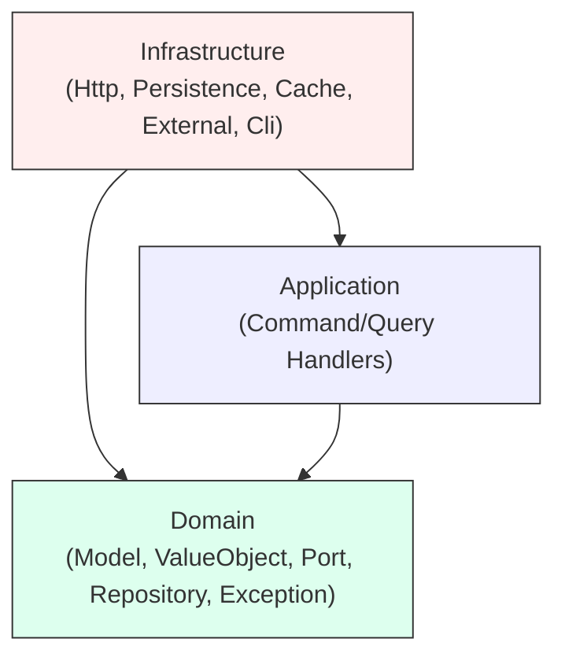
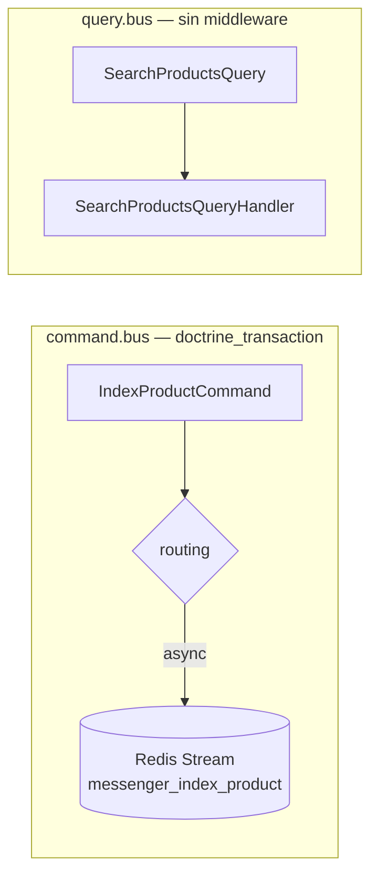
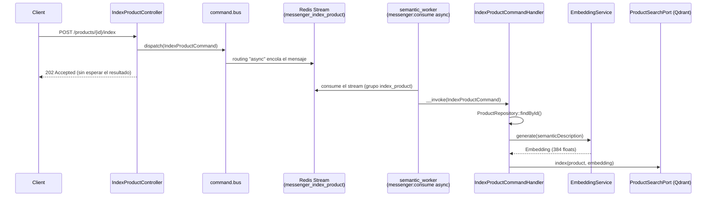
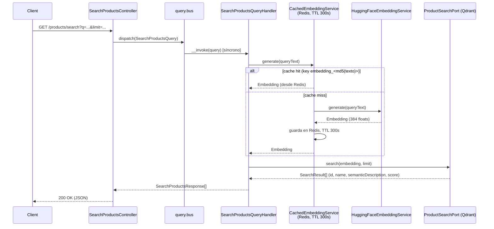
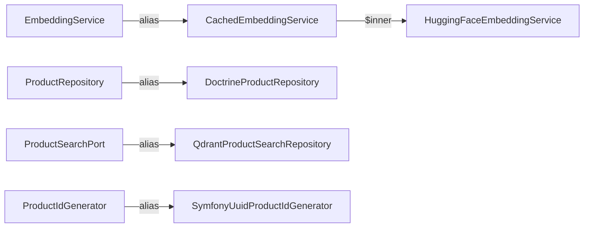
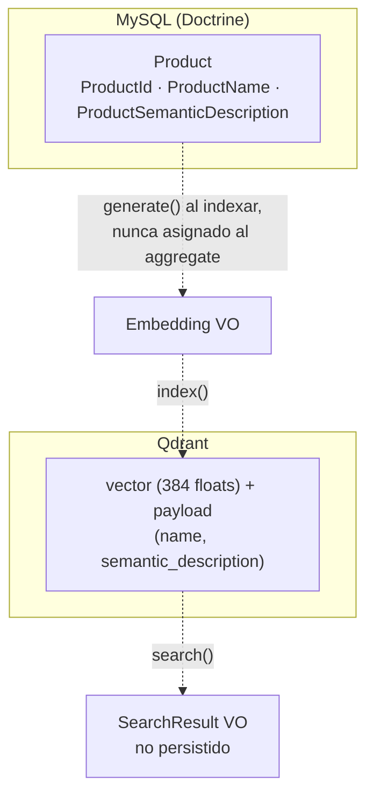

# Arquitectura

Buscador semántico de productos construido con Arquitectura Hexagonal + DDD + CQRS
sobre Symfony. Este documento explica el *porqué* de cada decisión estructural y sus
trade-offs, no el contrato de la API (eso vive en OpenAPI/Nelmio, `GET /api/doc`).

Cada sección referencia el fichero real donde se puede verificar lo descrito.

## 1. Capas y reglas de dependencia

El código de cada contexto (`src/Product/...`) se organiza en tres capas. Las reglas de
dependencia entre ellas se definen y se hacen cumplir automáticamente con Deptrac
([`web/deptrac.yaml`](../web/deptrac.yaml), ejecutado por `make deptrac`):



Regla exacta en `deptrac.yaml`:

```yaml
ruleset:
    Domain:
        - ~  # Domain must not depend on anything inside the project
    Application:
        - Domain
    Infrastructure:
        - Domain
        - Application
```

**Por qué**: el dominio (`Product`, los Value Objects, los puertos) no conoce Symfony,
Doctrine, Qdrant ni HuggingFace. Eso permite testear las reglas de negocio sin
infraestructura (`tests/Unit/Product/Domain/`) y sustituir cualquier adaptador (por
ejemplo cambiar Qdrant por otro motor vectorial) sin tocar una sola línea de dominio.

**Trade-off**: cada puerto nuevo exige una interfaz en `Domain/Port` más un adaptador en
`Infrastructure`, y el wiring en `web/config/services.yaml` — más indirección y ficheros
que una arquitectura en capas más laxa (p. ej. controlador → Doctrine directo). El
proyecto asume ese coste a cambio de que Deptrac falle en CI si alguien rompe la regla
(por ejemplo, si un `EmbeddingService` de dominio empezara a hacer `new HttpClient()`).

## 2. Buses de Symfony Messenger

El proyecto usa CQRS con dos buses independientes, configurados en
[`web/config/packages/messenger.yaml`](../web/config/packages/messenger.yaml):

```yaml
framework:
    messenger:
        default_bus: command.bus
        transports:
            async:
                dsn: '%env(REDIS_DSN)%'
                options:
                    stream: messenger_index_product
                    group: index_product
        routing:
            App\Product\Application\IndexProduct\IndexProductCommand: async
        buses:
            command.bus:
                middleware:
                    - doctrine_transaction
            query.bus: ~
```



**Por qué**: `command.bus` envuelve cada comando en una transacción Doctrine
(middleware `doctrine_transaction`) porque los comandos mutan estado (crear producto,
indexar). `query.bus` no lleva middleware porque las queries son de solo lectura y no
necesitan una transacción — evita el coste de abrir/cerrar una transacción MySQL en
cada búsqueda, que además ni siquiera toca MySQL (ver sección 4).

`IndexProductCommand` es el único mensaje enrutado al transporte `async` (un Redis
Stream); todo lo demás —incluida `CreateProductCommand`— se maneja síncronamente en el
mismo request. El handler de `IndexProductCommand` sigue registrado en `command.bus`
(`#[AsMessageHandler(bus: 'command.bus')]` en
[`IndexProductCommandHandler`](../web/src/Product/Application/IndexProduct/IndexProductCommandHandler.php)),
pero la entrega de Symfony Messenger enruta el mensaje en sí al transporte antes de
llegar al handler, por lo que la ejecución real ocurre en el worker.

**Trade-off**: separar los buses hace explícito en el propio código qué operación muta
estado y cuál no, pero obliga a decidir explícitamente en qué bus se registra cada
handler (`#[AsMessageHandler(bus: '...')]`) — un olvido aquí registra el handler en el
bus por defecto (`command.bus`) de forma silenciosa.

## 3. Flujo de indexación asíncrona

Verificado en
[`IndexProductController`](../web/src/Product/Infrastructure/Http/IndexProductController.php),
[`IndexProductCommandHandler`](../web/src/Product/Application/IndexProduct/IndexProductCommandHandler.php),
[`docker-compose.yml`](../docker-compose.yml) (servicio `worker`) y
[`QdrantProductSearchRepository`](../web/src/Product/Infrastructure/Persistence/Qdrant/QdrantProductSearchRepository.php).



**Por qué asíncrono**: generar un embedding implica una llamada HTTP a la HuggingFace
Inference API, con latencia variable e imprevisible. Devolver 202 de inmediato
(`IndexProductController::__invoke`) evita bloquear al cliente mientras el `worker`
(servicio `semantic_worker` en `docker-compose.yml`, comando
`messenger:consume async --time-limit=3600 --memory-limit=128M`) procesa la cola en
segundo plano.

**Por qué el aggregate no se muta**: `IndexProductCommandHandler` pasa el `Embedding`
generado directamente a `ProductSearchPort::index($product, $embedding)` sin asignarlo a
`$product`. El aggregate `Product` (ver
[`web/src/Product/Domain/Model/Product.php`](../web/src/Product/Domain/Model/Product.php))
no tiene ningún setter ni campo para el vector — el embedding es un concern de búsqueda,
no del ciclo de vida del producto (ver sección 6).

**Trade-off**: al ser asíncrono, un `POST /products/{id}/index` que devuelve 202 no
garantiza que el producto ya sea buscable inmediatamente después — hay una ventana de
tiempo entre encolar y que el `worker` lo procese. Si `IndexProductCommandHandler` lanza
`ProductNotFoundException` (producto borrado entre el encolado y el consumo), Messenger
reintenta hasta 3 veces (backoff exponencial x2, delay inicial 1s — valores por defecto,
sin `retry_strategy` explícito en `messenger.yaml`) y, si sigue fallando, el mensaje cae
al transporte `failed` (otro Redis Stream, `messenger_index_product_failed`), en vez de
perderse. Limitación conocida: al ser un Stream de Redis, ese transporte no implementa
listado por id, así que `messenger:failed:show|retry|remove` no funcionan sobre él —
`messenger:stats` sí reporta su conteo, y los mensajes solo pueden inspeccionarse
consumiéndolos directamente (`messenger:consume failed`).

## 4. Flujo de búsqueda semántica

Verificado en
[`SearchProductsController`](../web/src/Product/Infrastructure/Http/SearchProductsController.php),
[`SearchProductsQueryHandler`](../web/src/Product/Application/SearchProducts/SearchProductsQueryHandler.php),
[`CachedEmbeddingService`](../web/src/Product/Infrastructure/Cache/CachedEmbeddingService.php) y
[`QdrantProductSearchRepository`](../web/src/Product/Infrastructure/Persistence/Qdrant/QdrantProductSearchRepository.php).



**Por qué cachear el embedding de la query**: `CachedEmbeddingService` (decorador de
`EmbeddingService`, wireado como el adaptador de ese puerto en `services.yaml`) evita
llamar a la HuggingFace Inference API para textos de búsqueda repetidos. La clave es
`embedding_<md5(texto)>` y el TTL es de 300 segundos (constante `TTL` en la clase,
pool `cache.embeddings` configurado como adaptador Redis en
[`web/config/packages/cache.yaml`](../web/config/packages/cache.yaml)).

**Por qué no se consulta MySQL en la búsqueda**: `QdrantProductSearchRepository::search()`
lee `name` y `semantic_description` directamente del *payload* almacenado en Qdrant
(ver el `index()` del mismo repositorio, que escribe ese payload al indexar) y construye
el `SearchResult` sin volver a tocar `ProductRepository`/Doctrine. Esto ahorra un
`SELECT ... WHERE id IN (...)` por cada búsqueda.

**Trade-off — eventual consistency**: como el payload de Qdrant se escribe solo cuando se
ejecuta `POST /products/{id}/index`, si un producto se actualiza en MySQL pero no se
vuelve a indexar, las búsquedas seguirán devolviendo el `name`/`semanticDescription`
antiguos leídos de Qdrant. El sistema no reindexa automáticamente al actualizar un
producto — es una decisión consciente de rendimiento (evitar recalcular el embedding en
cada escritura) a cambio de tolerar resultados de búsqueda potencialmente obsoletos.

## 5. Wiring de puertos y adaptadores

Verificado línea a línea contra
[`web/config/services.yaml`](../web/config/services.yaml) (la tabla equivalente en
`CLAUDE.md` coincide con el código en la fecha de esta revisión):

| Puerto (Domain) | Adaptador (Infrastructure) | Notas de `services.yaml` |
|---|---|---|
| `Domain\Port\EmbeddingService` | `Infrastructure\Cache\CachedEmbeddingService` → `Infrastructure\External\HuggingFaceEmbeddingService` | `CachedEmbeddingService` recibe `$inner` (HuggingFace) y `$cache` (`@cache.embeddings`) explícitos |
| `Domain\Repository\ProductRepository` | `Infrastructure\Persistence\Doctrine\DoctrineProductRepository` | alias directo |
| `Domain\Port\ProductSearchPort` | `Infrastructure\Persistence\Qdrant\QdrantProductSearchRepository` | recibe `$qdrantDsn` desde `%env(QDRANT_DSN)%` |
| `Domain\Port\ProductIdGenerator` | `Infrastructure\Identity\SymfonyUuidProductIdGenerator` | alias directo, genera UUID v4 |



**Por qué**: `web/src/*/Domain/` está excluido de autowiring
(`services.yaml`, bloque `App\: exclude:`), así que el dominio nunca conoce sus
implementaciones; el contenedor de Symfony resuelve el puerto al adaptador vía alias
explícito. Cambiar de HuggingFace a otro proveedor de embeddings, o de Qdrant a otro
motor vectorial, es en teoría un cambio local a `services.yaml` + una clase nueva en
`Infrastructure`, sin tocar `Application` ni `Domain`.

**Trade-off**: el decorador `CachedEmbeddingService` no está anotado con
`#[AsDecorator]`; el cacheo se logra alias-eando el puerto directamente al decorador e
inyectándole el servicio real (`HuggingFaceEmbeddingService`) como `$inner` a mano. Es
explícito y fácil de leer, pero significa que si se añade un segundo consumidor del
puerto `EmbeddingService` que necesite el servicio *sin* caché, hay que exponer un
segundo alias — hoy no existe ese caso de uso.

## 6. Por qué `Embedding` y `SearchResult` no se persisten en MySQL

Verificado en
[`Domain/ValueObject/Embedding.php`](../web/src/Product/Domain/ValueObject/Embedding.php),
[`Domain/ValueObject/SearchResult.php`](../web/src/Product/Domain/ValueObject/SearchResult.php)
y [`Domain/Model/Product.php`](../web/src/Product/Domain/Model/Product.php).



- **`Embedding`**: es la representación vectorial (384 floats) de una descripción de
  producto o de una query de búsqueda. `Product` (el aggregate) solo tiene tres
  propiedades — `ProductId`, `ProductName`, `ProductSemanticDescription` — y ningún
  campo para el vector. `Embedding` se genera al indexar y se envía directamente a
  `ProductSearchPort::index()`; nunca se asigna al aggregate ni existe una columna para
  él en el esquema Doctrine.
- **`SearchResult`**: es el resultado de una búsqueda (`productId`, `name`,
  `semanticDescription`, `score`), construido enteramente a partir de la respuesta de
  Qdrant (`QdrantProductSearchRepository::search()`). No tiene mapeo Doctrine porque no
  representa una entidad de negocio persistente, sino la proyección de un hit de
  búsqueda en un instante dado.

**Por qué**: en el modelo de dominio (ver `CLAUDE.md`, sección "Domain model"), tanto
`Embedding` como `SearchResult` son *conceptos de búsqueda vectorial*, no del ciclo de
vida del `Product`. Mezclarlos con el aggregate (por ejemplo, añadiendo una columna
`embedding` en MySQL) acoplaría el dominio de catálogo a un detalle de implementación de
Qdrant y obligaría a mantener el vector sincronizado en dos sitios.

**Trade-off**: la contrapartida es la eventual consistency ya descrita en la sección 4 —
al no vivir el vector en la misma transacción que el aggregate, no hay forma de
garantizar atómicamente que "producto actualizado" implique "vector actualizado"; esa
sincronización depende de que el cliente llame explícitamente a
`POST /products/{id}/index` tras cada cambio relevante.
